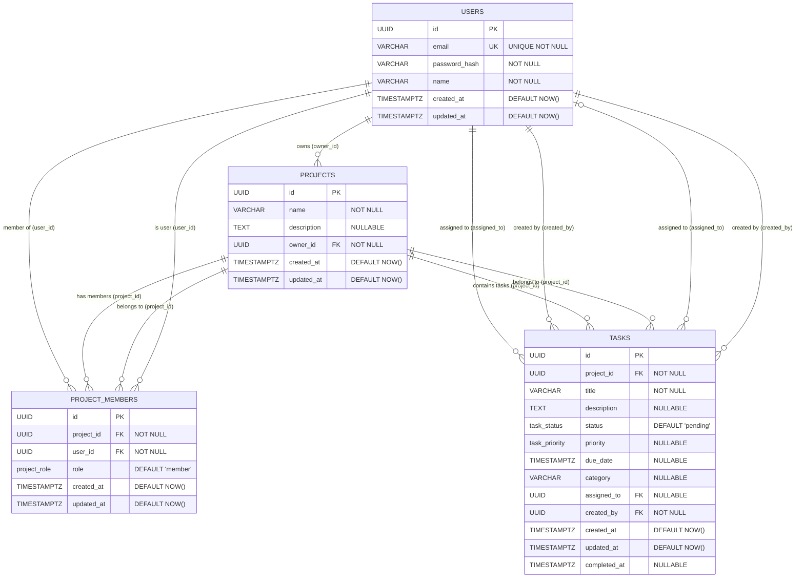

# Entity Relationship Diagram - Task Manager App

## Database Schema Visualization

This ERD represents the complete database schema design for the task manager application.



## Key Relationships Explained

### 1. Users → Projects (Ownership)
- **Type**: One-to-Many
- **Constraint**: `projects.owner_id → users.id`
- **Delete Rule**: CASCADE (if user deleted, their owned projects are deleted)
- **Business Rule**: Every project must have an owner

### 2. Users ↔ Projects (Membership)
- **Type**: Many-to-Many (through project_members)
- **Junction Table**: `project_members`
- **Constraints**: 
  - `project_members.user_id → users.id` (CASCADE DELETE)
  - `project_members.project_id → projects.id` (CASCADE DELETE)
  - `UNIQUE(project_id, user_id)` - prevents duplicate memberships
- **Business Rule**: Users can be members of multiple projects, projects can have multiple members

### 3. Projects → Tasks
- **Type**: One-to-Many
- **Constraint**: `tasks.project_id → projects.id`
- **Delete Rule**: CASCADE (if project deleted, all its tasks are deleted)
- **Business Rule**: Every task belongs to exactly one project

### 4. Users → Tasks (Assignment)
- **Type**: One-to-Many (optional)
- **Constraint**: `tasks.assigned_to → users.id`
- **Delete Rule**: SET NULL (if user deleted, tasks become unassigned)
- **Business Rule**: Tasks can be unassigned or assigned to one user

### 5. Users → Tasks (Creation)
- **Type**: One-to-Many
- **Constraint**: `tasks.created_by → users.id`
- **Delete Rule**: CASCADE (if user deleted, tasks they created are deleted)
- **Business Rule**: Every task must have a creator

## Data Types & Constraints

### ENUM Types
```sql
CREATE TYPE project_role AS ENUM ('owner', 'member');
CREATE TYPE task_status AS ENUM ('pending', 'completed');  
CREATE TYPE task_priority AS ENUM ('low', 'medium', 'high');
```

### Unique Constraints
- `users.email` - UNIQUE (no duplicate email addresses)
- `(project_members.project_id, project_members.user_id)` - UNIQUE (no duplicate memberships)

### Check Constraints
- Email format validation on users.email
- Non-empty strings for names and titles
- Completed tasks must have completed_at timestamp

### Indexes for Performance
- **Primary Keys**: Automatically indexed
- **Foreign Keys**: All FK columns indexed
- **Search Fields**: email, name, title
- **Filter Fields**: status, priority, due_date, category
- **Composite**: (project_id, status), (assigned_to, status), (project_id, assigned_to)

## Security & Access Patterns

### Multi-Tenancy Rules
1. **Project Access**: User can access project if:
   - They own the project (`projects.owner_id = user_id`)
   - They are a member (`project_members.user_id = user_id`)

2. **Task Access**: User can access task if:
   - They have access to the parent project
   - Inherited through project permissions

3. **Member Access**: User can see project members if:
   - They have access to the parent project

### Common Query Patterns

#### Get User's Projects
```sql
SELECT p.*, 
       CASE WHEN p.owner_id = $user_id THEN 'owner' 
            ELSE pm.role 
       END as user_role
FROM projects p
LEFT JOIN project_members pm ON p.id = pm.project_id AND pm.user_id = $user_id  
WHERE p.owner_id = $user_id OR pm.user_id = $user_id;
```

#### Get User's Tasks
```sql
SELECT t.*
FROM tasks t
JOIN projects p ON t.project_id = p.id
WHERE p.owner_id = $user_id 
   OR EXISTS (
     SELECT 1 FROM project_members pm 
     WHERE pm.project_id = p.id AND pm.user_id = $user_id
   );
```

## Future Extensions

### Additional Tables (Ready for Implementation)
- `task_comments`: Task discussion threads
- `task_attachments`: File attachments to tasks  
- `activity_logs`: Audit trail of user actions
- `notifications`: User notification system
- `project_templates`: Reusable project templates

### Role Extensions
- Current roles: `'owner'`, `'member'`
- Future roles: `'admin'`, `'viewer'`, `'contributor'`
- Command: `ALTER TYPE project_role ADD VALUE 'admin';`

### Status Extensions  
- Current statuses: `'pending'`, `'completed'`
- Future statuses: `'in_progress'`, `'blocked'`, `'cancelled'`
- Command: `ALTER TYPE task_status ADD VALUE 'in_progress';`

## Performance Considerations

### Expected Query Performance
- User login (email lookup): ~10ms
- Project list (with membership JOINs): ~50ms
- Task list (with project filtering): ~100ms  
- Task creation (simple INSERT): ~20ms
- Complex task filtering: ~150ms

### Optimization Strategies
- Composite indexes for common filter combinations
- Partial indexes for frequently filtered subsets
- Connection pooling for concurrent access
- Query result caching for read-heavy operations
- Proper LIMIT/OFFSET for pagination

## Type Safety Verification

### Database → TypeScript Mapping
| Database Type | TypeScript Type | Notes |
|---------------|-----------------|-------|
| `UUID` | `string` | String representation of UUID |
| `VARCHAR(n)` | `string` | Text with length limit |
| `TEXT` | `string \| null` | Unlimited text, nullable |
| `TIMESTAMPTZ` | `Date` | Timezone-aware timestamp |
| `project_role` | `'owner' \| 'member'` | Exact enum match |
| `task_status` | `'pending' \| 'completed'` | Exact enum match |
| `task_priority` | `'low' \| 'medium' \| 'high' \| null` | Nullable enum |

This ERD provides a complete visual representation of the database schema, ensuring all relationships, constraints, and data types are clearly documented for implementation in task T006 (migration scripts).